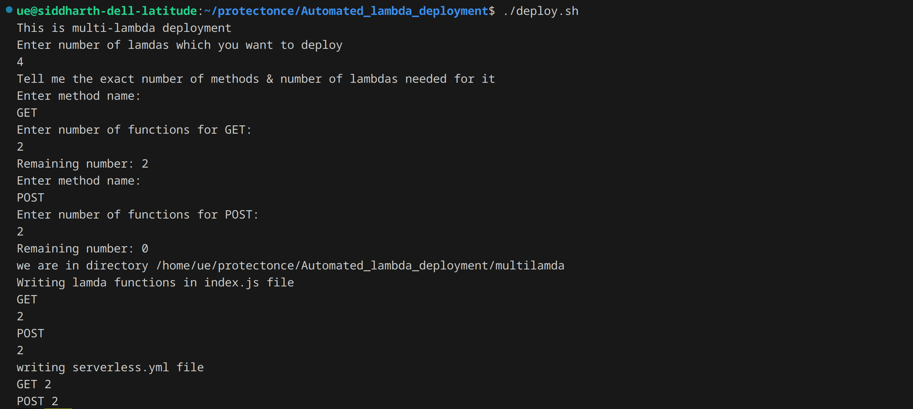
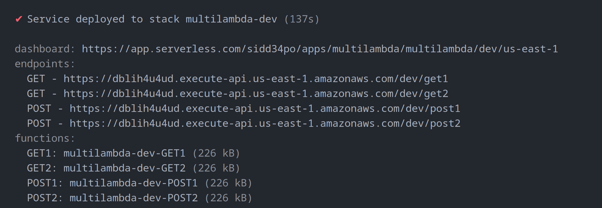
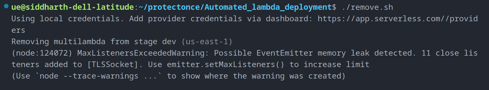

# This is multiple lambda deployment using SLS

Important commands

* chmod +x ./deploy.sh
* chmod +x ./remove.sh

To run the script

* sudo bash ./deploy.sh

Once you'r done using the resource

* sudo bash ./remove.sh

Output

Removing the resource

